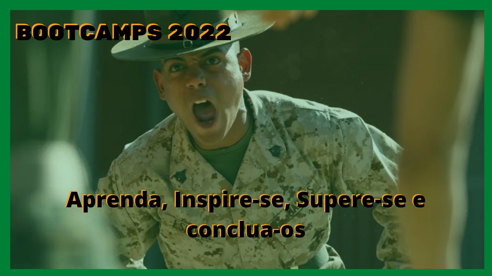

<!-- PROJECT SHIELDS -->

[![Contributors][contributors-shield]][contributors-url]
[![Forks][forks-shield]][forks-url]
[![Stargazers][stars-shield]][stars-url]
[![Issues][issues-shield]][issues-url]
[![MIT License][license-shield]][license-url]
[![LinkedIn][linkedin-shield]][linkedin-url]

<!-- PROJECT LOGO -->

# DIO - Digital Innovation One : Bootcamps

Meus bootcamps na DIO, suor, menos cabelos, dedos ligeiros e diversao, Modo Ludico de aprender novas tecnologias.
Surfando no estado da arte em Tecnologia da Informaçao

# Lista de Inscriçao

 
## 2022-01-23
:trophy: 2022-01-07
### https://web.dio.me/track/decola-tech-2a-edicao
- [Conteudo programatico](Decola_Tech2aEdicao.md)
 
- :scroll: [Certificado](./Certificados/Decola_Tech2aEdicao.md)

 
 

 
## 2022-01-30
:trophy: 2022-01-18
### https://web.dio.me/track/amdocs-java-developer
- [Conteudo programatico](Amdocs_JavaDeveloper.md)
 
- :scroll: [Certificado](./Certificados/Amdocs_JavaDeveloper.md)

 

## 2022-02-01
:trophy: 2022-01-19
### https://web.dio.me/track/cognizant-java-developer
- [Conteudo programatico](Cognizant_JavaDeveloper.md)

- :scroll: [Certificado](./Certificados/Cognizant_JavaDeveloper.md)

  

 
## 2022-01-30
:trophy: 2022-01-19
### https://web.dio.me/track/gft-start-3-java?tab=path
- [Conteudo programatico](GFT_Start3_Java.md)

- :scroll: [Certificado](./Certificados/GFT_Start3_Java.md)

  
 
 
 
---

<!-- PROJECT LOGO -->

# Work in progress
 
## 2022-01-30
### https://web.dio.me/track/gft-start-3-net
- [Conteudo programatico](GFT_Start3_DotNet.md)
  
 
## 2022-02-28
### https://web.dio.me/track/localiza-net-developer-2
- [Conteudo programatico](Localiza_DotNetDeveloper2.md)
  
 
## 2022-02-13
### https://web.dio.me/track/inter-frontend-developer
- [Conteudo programatico](Inter_FrontEndDeveloper.md)
  
 
## 2022-03-10
### https://web.dio.me/track/mrv-fullstack-developer
- [Conteudo programatico](MRV_FullstackDeveloper.md)
  
 

## 2022-03-10
### https://web.dio.me/track/ntt-data-android-developer
- [Conteudo programatico](NTT_DataAndroidDeveloper.md)
   
 
## 2022-03-20
###  https://web.dio.me/track/take-blip-web-developer
- [Conteudo programatico](TakeBlip_WebDeveloper.md)
  

---

#### * DIO - Digital Inovation One *
######  [Inscreva-se na Dio](https://digitalinnovation.one/sign-up?ref=R5J3ZLTIFS)  

######  [Vagner Bellacosa perfil na Dio](https://web.dio.me/users/vagnerbellacosa?tab=achievements)  

<!-- MARKDOWN LINKS & IMAGES -->
<!-- https://www.markdownguide.org/basic-syntax/#reference-style-links -->
[contributors-shield]: https://img.shields.io/github/contributors/VagnerBellacosa/DIO_Bootcamps.svg?style=for-the-badge
[contributors-url]: https://github.com/VagnerBellacosa/DIO_Bootcamps/graphs/contributors
[forks-shield]: https://img.shields.io/github/forks/VagnerBellacosa/DIO_Bootcamps.svg?style=for-the-badge
[forks-url]: https://github.com/VagnerBellacosa/DIO_Bootcamps/network/members
[stars-shield]: https://img.shields.io/github/stars/VagnerBellacosa/DIO_Bootcamps.svg?style=for-the-badge
[stars-url]: https://github.com/VagnerBellacosa/DIO_Bootcamps/stargazers
[issues-shield]: https://img.shields.io/github/issues/VagnerBellacosa/DIO_Bootcamps.svg?style=for-the-badge
[issues-url]: https://github.com/VagnerBellacosa/DIO_Bootcamps/issues
[license-shield]: https://img.shields.io/github/license/VagnerBellacosa/DIO_Bootcamps.svg?style=for-the-badge
[license-url]: https://github.com/VagnerBellacosa/DIO_Bootcamps/blob/master/LICENSE.txt
[linkedin-shield]: https://img.shields.io/badge/-LinkedIn-black.svg?style=for-the-badge&logo=linkedin&colorB=555
[linkedin-url]: https://www.linkedin.com/in/VagnerBellacosa/
[product-screenshot]: Images/Bootcamp_Logo2022.png 

